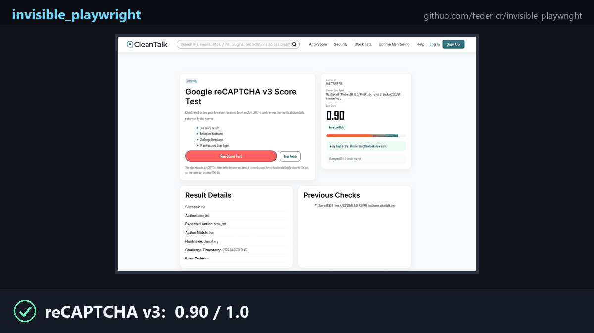

# invisible_playwright

[](https://github.com/feder-cr/invisible_playwright/actions/workflows/tests.yml)
[](LICENSE)
[](https://www.python.org/downloads/)
[](https://www.mozilla.org/firefox/)
[](https://github.com/feder-cr/invisible_playwright/releases)
[](https://github.com/feder-cr/invisible_playwright/stargazers)
[](https://github.com/feder-cr/invisible_firefox/releases/tag/usage-counter)

[](https://it.linkedin.com/in/federico-elia-5199951b6)

**Stealth Firefox that passes every bot detection test. Drop-in Playwright replacement, fingerprint patched at the C++ level, not a JavaScript shim.**




## How it works


**Most other anti-detect browsers patch Chromium at the JavaScript level** - they override `navigator`, `WebGLRenderingContext.getParameter`, canvas APIs, and so on via injected scripts. This has two fatal problems:

1. **JS patches are detectable.** Anti-bots enumerate native function `.toString()`, check descriptor configurability, compare property enumeration order, watch for prototype mutations. Every patch leaves a fingerprint of its own. CreepJS has an entire battery of "lies detectors" built around this.
2. **Chromium itself is now suspect.** Residential-proxy bot traffic is overwhelmingly Chromium-based, so detectors weight anything Chromium-shaped as risky by default. Chromium-based forks inherit Chrome's open-source layers (BoringSSL, Blink, V8, ANGLE) cleanly, but they still cannot fully match Chrome in practice: Chrome ships closed-source components on top (Widevine, proprietary codecs, Google Update / Safe Browsing endpoints) that flip detectable JS feature flags and network signals, and forks lag Chrome's release cadence by days to weeks, leaving telltale version-specific behaviours that detectors lock onto.

**invisible_playwright patches Firefox at the C++ level.** The spoofed values come back out through the normal Gecko paths - there is no JS shim, no override, no `Object.defineProperty`. **From the page's point of view, the browser is just telling the truth.** Anti-bot lie-detectors have nothing to latch onto.

invisible_playwright spoofs **all the layers that matter, together, coherently**: Navigator, screen, GPU/WebGL, Canvas, fonts, audio, WebRTC, timezone, DevTools detection, SOCKS5 auth, and the rest. See [feder-cr/invisible_firefox](https://github.com/feder-cr/invisible_firefox) for the full per-layer breakdown of which C++ files are patched and why.

Everything is driven by preferences - no hardcoded values in the binary. You change one pref, you change the spoofed value.

---

## How it compares

**CloakBrowser** ships a similar pitch for Chromium, but its binary is **closed source** (the source-level patches are not published, you only get the compiled output), and it still hits the Chromium reCAPTCHA ceiling. The commercial anti-detect browsers (**Multilogin**, **GoLogin**, AdsPower, Dolphin, Kameleo) are paid SaaS that overlay JS-layer spoofing on a patched Chromium. Managed profiles are nice but raw detection bypass sits below both Camoufox and us.

| | invisible_playwright | Camoufox | CloakBrowser | Multilogin |
|---|---|---|---|---|
| Engine | Firefox 150 | Firefox (~1 year old base) | Chromium | Chromium fork | 
| Patch depth | C++ source | C++ source | C++ source  | JS overrides | 
| Maintenance | Active | Gap (~1 year) | Active | Active SaaS | 
| Open source | ✅ MIT | ✅ MPL | ❌ Closed source | ❌ Closed source | 
| `.toString()` clean | ✅ | ✅ | ✅ | ❌ Detectable shims | 
| Canvas / WebGL / Audio | ✅ C++ | ⚠️ Drift vs current FF | ✅ C++ | ⚠️ JS override |
| SOCKS5 auth | ✅ Patched | ❌ | ⚠️ Playwright proxy | ⚠️ Varies | 
| **reCAPTCHA v3 score** | **0.90** | ~0.3-0.5 | ~0.3-0.5 | ~0.3-0.6 | 
| FP Pro - bot detected | ✅ Not detected | ❌ Detected | ❌ Detected | ❌ Detected | 
| CreepJS lies | ✅ 0 | ❌ Multiple | ✅ 0 | ❌ Multiple | 
| Cost | Free | Free | Free | From $99/mo | 

---

## Install

```bash
pip install git+https://github.com/feder-cr/invisible_playwright.git
python -m invisible_playwright fetch      # one-time ~100 MB download, SHA256-verified
```

Supported platforms: **Windows x86_64**, **Linux x86_64 / arm64**, **macOS arm64 / x86_64**. On macOS the app is ad-hoc signed (not notarized): if Gatekeeper complains, clear the quarantine flag once with `xattr -dr com.apple.quarantine` on the cached `Firefox.app`.

---

## Usage
### Random fingerprint per session
**100% Playwright-compatible** - sync and async, all methods, zero API changes. If you already use Playwright, switching is two lines:

```diff
- from playwright.sync_api import sync_playwright
- with sync_playwright() as p:
-     browser = p.firefox.launch()
+ from invisible_playwright import InvisiblePlaywright
+ with InvisiblePlaywright() as browser:
```

Every session gets a unique, coherent fingerprint drawn from real-world Firefox telemetry (GPU / audio / fonts / ~400 other fields) and Bezier-curve mouse motion baked into the browser itself.

**Sync**
```python
from invisible_playwright import InvisiblePlaywright

with InvisiblePlaywright(proxy={"server": "socks5://...", "username": "u", "password": "p"}) as browser:
    page = browser.new_page()
    page.goto("https://example.com")
    page.click("#submit")   # mouse arcs to the button on a Bezier curve
```

**Async**
```python
from invisible_playwright.async_api import InvisiblePlaywright

async with InvisiblePlaywright(proxy={"server": "socks5://...", "username": "u", "password": "p"}) as browser:
    page = await browser.new_page()
    await page.goto("https://example.com")
    await page.click("#submit")
```

The `browser` object is a `playwright.sync_api.Browser` / `playwright.async_api.Browser` - every Playwright method works as-is.

---

### Random fingerprint per session

```python
from invisible_playwright import InvisiblePlaywright

with InvisiblePlaywright() as browser:
    page = browser.new_page()
    page.goto("https://creepjs-api.web.app")
```

Every call samples a new coherent profile. Log the seed to reproduce interesting runs:

```python
sf = InvisiblePlaywright()
with sf as browser:
    print("seed =", sf.seed)
    # ...
```

### Reproducible fingerprint

```python
with InvisiblePlaywright(seed=42) as browser:
    ...   # same GPU, same canvas hash, same audio context, every run
```

### Proxies

```python
proxy = {
    "server": "socks5://gate.example.com:1080",
    "username": "user",
    "password": "pass",
}
with InvisiblePlaywright(proxy=proxy) as browser:
    ...
```

Schemes supported: `socks5`, `socks4`, `http`, `https`. Auth works on all of them (SOCKS5 via patched `nsProtocolProxyService.cpp`, HTTP/HTTPS via Playwright). DNS is routed through the proxy by default, no local leak.

### Timezone

The browser timezone follows `timezone=`:

```python
# default: timezone is auto-derived from the egress IP (proxy egress if a
# proxy is set, otherwise the host's own public IP)
with InvisiblePlaywright(proxy=proxy) as browser:
    ...

# explicit IANA zone always wins — the only way to force a specific zone
with InvisiblePlaywright(proxy=proxy, timezone="America/New_York") as browser:
    ...
```

### Pinning specific fingerprint fields

By default everything comes from `seed`. To force specific values while the rest stays seed-derived:

```python
with InvisiblePlaywright(
    seed=42,
    pin={
        "gpu.renderer": "ANGLE (NVIDIA, NVIDIA GeForce RTX 4090 Direct3D11)",
        "gpu.vendor":   "Google Inc. (NVIDIA)",
        "screen.width":  2560,
        "screen.height": 1440,
        "hardware.concurrency": 16,
    },
) as browser:
    ...
```

Full list of pinnable keys, how pinning interacts with the Bayesian sampler, and common patterns are in **[docs/pinning.md](docs/pinning.md)**.

---

## CLI

```bash
invisible_playwright fetch          # download the binary if missing
invisible_playwright fetch --force  # re-download even if cached
invisible_playwright path           # print the absolute path to the cached binary
invisible_playwright version        # wrapper and binary versions
invisible_playwright clear-cache    # remove all cached binaries
```

## Related projects

Related projects that cover similar ground:

- **[arkenfox/user.js](https://github.com/arkenfox/user.js)** - the canonical Firefox configuration for privacy/security hardening via prefs. Reading arkenfox is how you understand which `user.js` knobs matter; invisible_playwright goes further by patching the C++ source where prefs alone are insufficient (Canvas noise, WebGL parameter overrides, font whitelisting, WebRTC IP swap, DevTools detection bypass).
- **[LibreWolf](https://librewolf.net)** - a Firefox fork bundled with sensible privacy defaults. Same audience, different distribution model: LibreWolf ships a configured Firefox binary, invisible_playwright ships source patches + a wrapper for automation.
- **[Camoufox](https://github.com/daijro/camoufox)** - the most well-known open-source anti-detect Firefox project. We share design goals on the fingerprint-spoofing side; the implementation approach differs (Camoufox patches a wider surface and ships its own fingerprint database, while invisible_playwright sticks closer to vanilla and drives spoofing from a Bayesian sampler).

---

## License

MIT - see [LICENSE](LICENSE). The patched Firefox binary is distributed under the MPL-2.0 (Firefox upstream license). The C++ patches against mozilla-central that produce that binary are at [feder-cr/invisible_firefox](https://github.com/feder-cr/invisible_firefox).

---

## Disclaimer

This project is for educational purposes only. It is provided as-is, with no warranties. I take no responsibility for how it is used. Use it at your own risk and in compliance with the laws of your jurisdiction.
